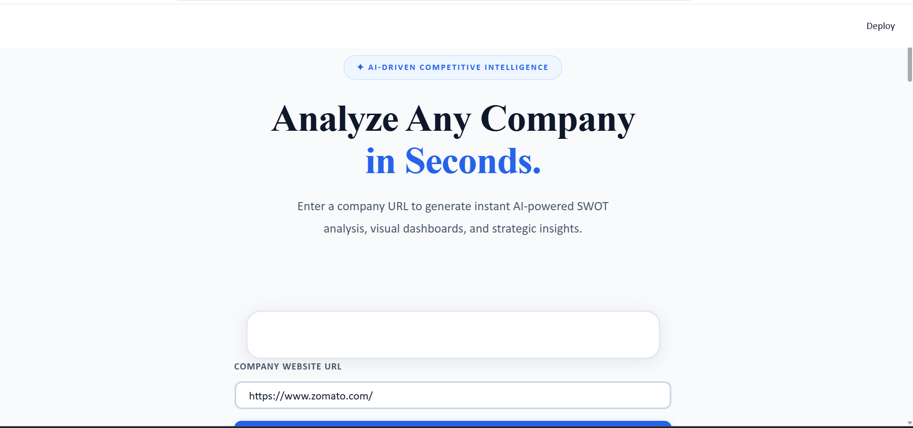
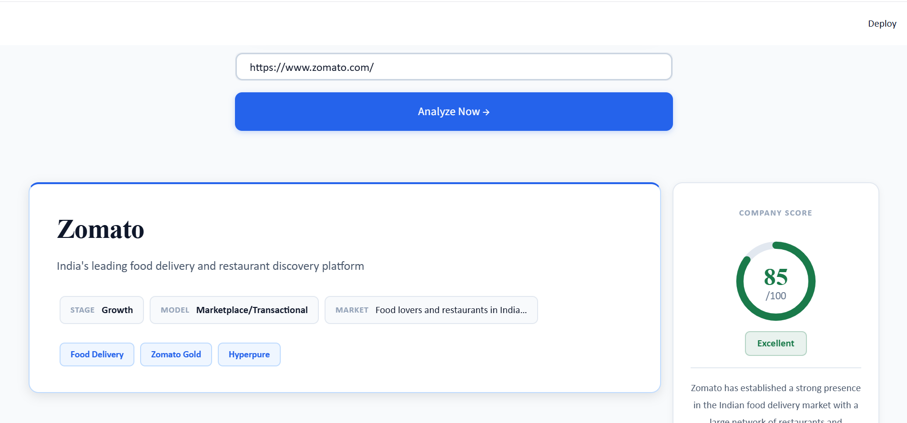
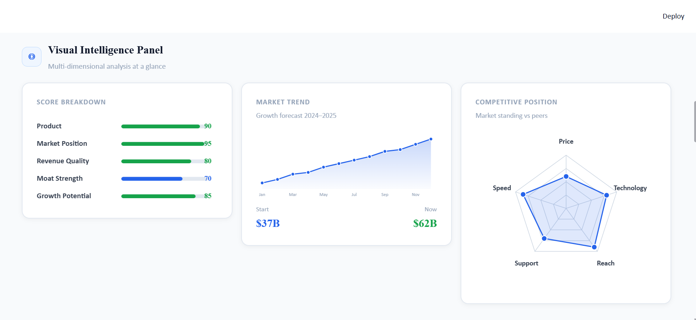

# Company Intelligence Platform

AI-powered competitive intelligence platform that analyzes any company website and generates strategic business insights in seconds.

## Features

* Executive Summary Generation
* Company Profiling
* Revenue Model Analysis
* Competitor Discovery
* SWOT Analysis
* Risk Assessment
* Growth Opportunity Identification
* Company Scoring Dashboard
* Interactive Business Intelligence Visualizations

## Tech Stack

* Python
* Streamlit
* LangChain
* Groq (Llama 3.3)
* Web Scraping
* Plotly
* Pandas

## How It Works

1. User enters a company website URL.
2. The system extracts and processes website content.
3. LangChain orchestrates the analysis pipeline.
4. Groq-powered LLM generates business insights.
5. Results are displayed through an interactive dashboard.

## Key Insights Generated

* Company Overview
* Business Model
* Market Position
* Competitor Analysis
* Strengths
* Risks
* Growth Opportunities
* Strategic Recommendations

## Screenshots





## Installation

```bash
git clone <repository-url>
cd Company-Intelligence-Platform

pip install -r requirements.txt

streamlit run app.py
```

## Future Improvements

* Real-time market intelligence
* Financial data integration
* News sentiment analysis
* Industry benchmarking
* Exportable PDF reports
* Multi-company comparison dashboard

## Author

Harsh Raj

LinkedIn: https://www.linkedin.com/in/harsh-raj-bbb18436a/

GitHub: https://github.com/harshu290
